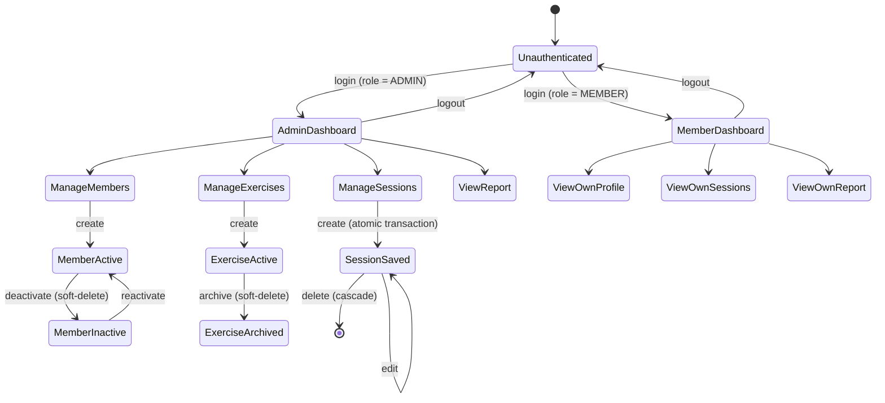
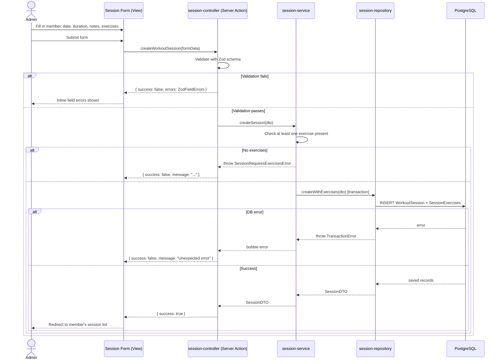
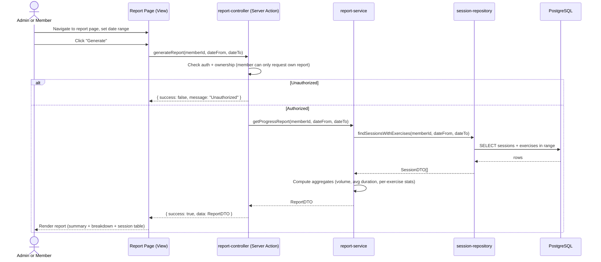
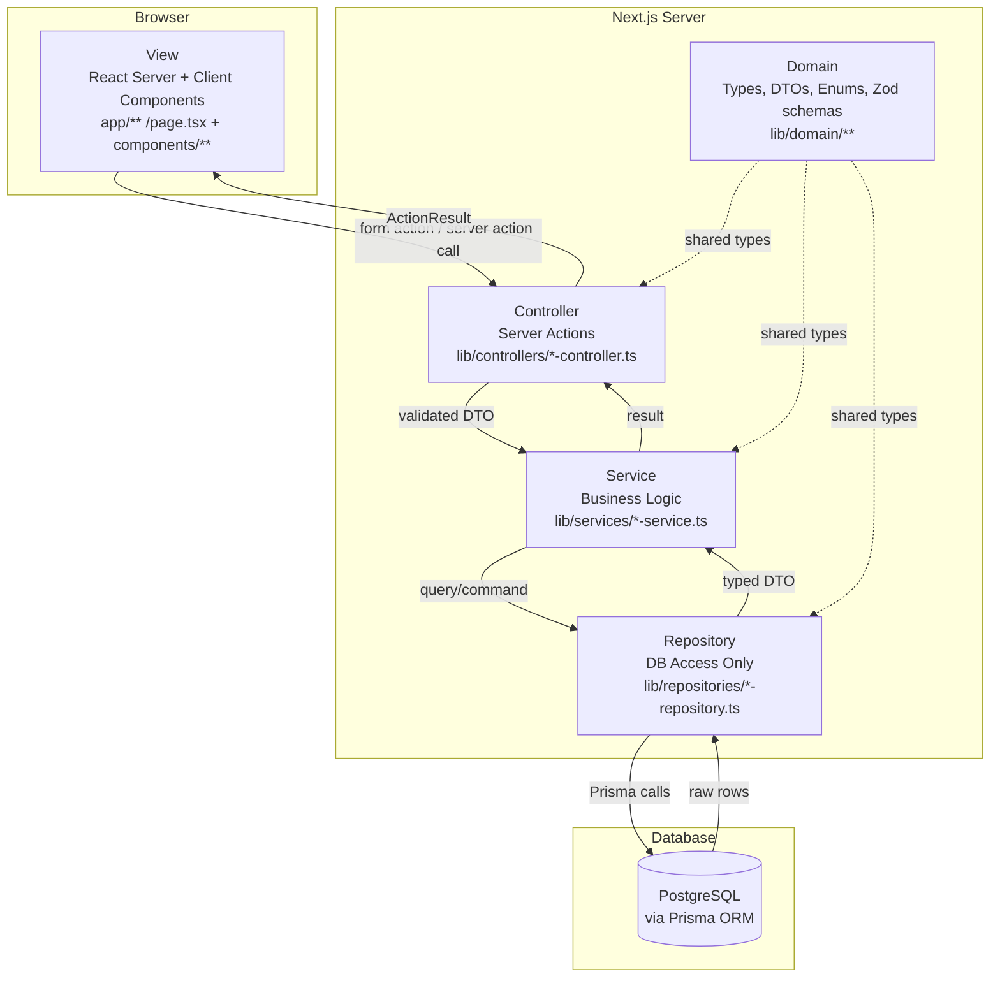
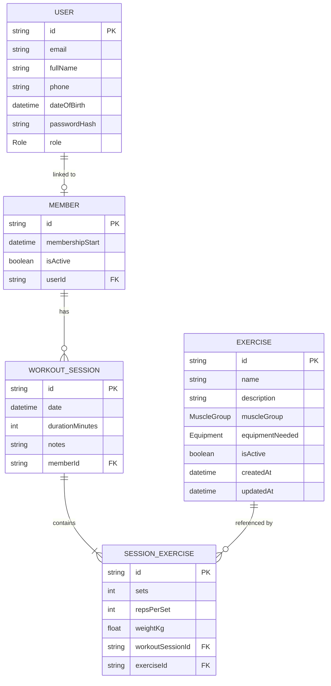
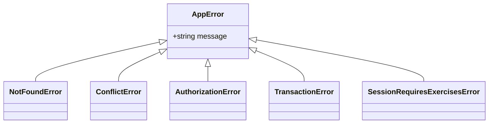

# GymTracker - Software Specification Document

## Overview

Small gyms and personal trainers need a lightweight digital tool to manage their members, maintain an exercise
catalogue, and record workout sessions. Currently most small gyms rely on paper logs or generic spreadsheets, leading
to:

- No traceability of a member's performance over time.
- No quick way to identify which exercises are most used or most improved upon.
- No structured view of session frequency or training intensity per member.

**GymTracker** is a web-based application with two distinct user interfaces - one for **Administrators (trainers)** and
one for **Members** - that enables:

1. Administrators to manage **Members** of the gym (CRUD).
2. Administrators to manage a catalogue of **Exercises** (CRUD).
3. Administrators to log **Workout Sessions** that link a member to a set of exercises with recorded metrics (CRUD).
4. A cross-entity operation: _log a complete workout session_ for a member, associating one or more exercises with
   performance data in a single atomic action (uses all 3 entities).
5. A **Progress Report** for a selected member showing the evolution of their training over time - total volume, session
   frequency, and per-exercise improvement.

---

## 2. Stakeholders & User Needs

### 2.1 Stakeholders

| ID | Stakeholder   | Description                                                                     |
|----|---------------|---------------------------------------------------------------------------------|
| S1 | Administrator | A trainer who manages the gym. Has full access to all data and operations.      |
| S2 | Member        | A gym customer. Can only view their own profile, sessions, and progress report. |

### 2.2 User Needs

| ID    | As a(n)...    | I need to...                                                                                           | So that...                                                                      |
|-------|---------------|--------------------------------------------------------------------------------------------------------|---------------------------------------------------------------------------------|
| UN-01 | Administrator | Add, edit, deactivate, and view members                                                                | The member base stays accurate and historical data is preserved                 |
| UN-02 | Administrator | Manage a catalogue of exercises with muscle group and equipment info                                   | Trainers can pick from standardised, consistent exercises when logging sessions |
| UN-03 | Administrator | Log a full workout session for a member in one action, picking exercises and entering sets/reps/weight | No training data is lost and sessions are recorded atomically                   |
| UN-04 | Administrator | Generate a progress report for any member filtered by date range                                       | Training effectiveness can be assessed and shared with the member               |
| UN-05 | Member        | Log in and view my own training history and progress report                                            | I can track my own improvement without accessing other members' data            |
| UN-06 | Member        | View my own profile information                                                                        | I can verify the data the gym holds about me                                    |
| UN-07 | Administrator | Be the only one who can create, edit, or delete records                                                | Data integrity is maintained and members cannot tamper with sessions            |

---

## 3. System Scope & Boundaries

### 3.1 In Scope

- Custom session-based authentication.
- Two roles: **Admin** and **Member**, with clearly separated views and permissions.
- Full CRUD for: `Member`, `Exercise`, `WorkoutSession` (and its child `SessionExercise`).
- Cross-entity workflow: _Log Workout Session_ (links Member + WorkoutSession + Exercise).
- Report: _Member Progress Report_ (filterable by date range).

### 3.2 Out of Scope

- Self-registration by members (Admin creates all accounts).
- Payment processing or subscription management.
- Exercise video or image embedding.
- Mobile native app.
- Real-time notifications or messaging.
- Integration with wearables or third-party fitness APIs.

### 3.3 Assumptions

- One deployment instance per gym.
- At least one Admin account is seeded at initialization.
- PostgreSQL database is provisioned and accessible before first launch.
- Users access the system via a modern browser (Chrome, Firefox, Edge).
- All weights are recorded in kilograms.

---

## 4. Functional Requirements

### 4.1 Authentication (AUTH)

| ID      | Requirement                                                                                            | Role  | Priority |
|---------|--------------------------------------------------------------------------------------------------------|-------|----------|
| AUTH-01 | The system SHALL allow login with email and password.                                                  | Both  | HIGH     |
| AUTH-02 | The system SHALL hash passwords using bcrypt with 12 salting rounds before storing them.               | -     | HIGH     |
| AUTH-03 | The system SHALL create a server-side session on successful login and destroy it on logout.            | Both  | HIGH     |
| AUTH-04 | The system SHALL redirect unauthenticated users to the login page for any protected route.             | -     | HIGH     |
| AUTH-05 | The system SHALL direct Admins to the Admin dashboard and Members to the Member dashboard after login. | Both  | HIGH     |
| AUTH-06 | Member accounts SHALL only be created by an Admin; there is no self-registration.                      | Admin | HIGH     |

### 4.2 Member Management (MEM) - Admin View

| ID     | Requirement                                                                                                                                | Priority |
|--------|--------------------------------------------------------------------------------------------------------------------------------------------|----------|
| MEM-01 | The system SHALL allow an Admin to create a Member account with: full name, email, date of birth, phone number, and membership start date. | HIGH     |
| MEM-02 | The system SHALL auto-generate a temporary password for new Member accounts, displayed once to the Admin.                                  | HIGH     |
| MEM-03 | The system SHALL allow an Admin to view a paginated, searchable list of all Members.                                                       | HIGH     |
| MEM-04 | The system SHALL allow an Admin to view the full detail page of any Member.                                                                | HIGH     |
| MEM-05 | The system SHALL allow an Admin to update any field of a Member record.                                                                    | HIGH     |
| MEM-06 | The system SHALL allow an Admin to soft-delete (deactivate) a Member, preserving all historical session data.                              | HIGH     |
| MEM-07 | The system SHALL prevent duplicate email addresses across Member records.                                                                  | HIGH     |

### 4.3 Exercise Management (EXC) - Admin View

| ID     | Requirement                                                                                                                                      | Priority |
|--------|--------------------------------------------------------------------------------------------------------------------------------------------------|----------|
| EXC-01 | The system SHALL allow an Admin to create an Exercise with: name, description, muscle group (enum), and equipment required.                      | HIGH     |
| EXC-02 | The system SHALL allow an Admin to view the full exercise catalogue.                                                                             | HIGH     |
| EXC-03 | The system SHALL allow an Admin to update an Exercise record.                                                                                    | HIGH     |
| EXC-04 | The system SHALL allow an Admin to archive an Exercise (soft-delete), removing it from new session forms while preserving historical references. | HIGH     |
| EXC-05 | Exercise names SHALL be unique within the system.                                                                                                | MEDIUM   |
| EXC-06 | Members SHALL be able to view the exercise catalogue in read-only mode.                                                                          | MEDIUM   |

### 4.4 Workout Session Management (WS) - Admin View

| ID    | Requirement                                                                                                                                                           | Priority |
|-------|-----------------------------------------------------------------------------------------------------------------------------------------------------------------------|----------|
| WS-01 | The system SHALL allow an Admin to create a Workout Session for a Member, specifying: date, duration in minutes, and optional notes.                                  | HIGH     |
| WS-02 | During session creation, the Admin SHALL be able to add one or more Session Exercises, each specifying: the Exercise, number of sets, reps per set, and weight in kg. | HIGH     |
| WS-03 | A Workout Session SHALL require at least one Session Exercise before it can be saved.                                                                                 | HIGH     |
| WS-04 | The creation of a Workout Session and all its Session Exercises SHALL be atomic (single database transaction).                                                        | HIGH     |
| WS-05 | The system SHALL allow an Admin to view a list of Workout Sessions for a given Member, ordered by date descending.                                                    | HIGH     |
| WS-06 | The system SHALL allow an Admin to edit the date, duration, and notes of an existing Workout Session.                                                                 | MEDIUM   |
| WS-07 | The system SHALL allow an Admin to add or remove Session Exercises from an existing Workout Session.                                                                  | MEDIUM   |
| WS-08 | The system SHALL allow an Admin to delete a Workout Session, cascading the deletion to its Session Exercises.                                                         | MEDIUM   |

### 4.5 Member Self-View (MSV) - Member View

| ID     | Requirement                                                                     | Priority |
|--------|---------------------------------------------------------------------------------|----------|
| MSV-01 | The system SHALL allow a Member to view their own profile (read-only).          | HIGH     |
| MSV-02 | The system SHALL allow a Member to view their own Workout Sessions (read-only). | HIGH     |
| MSV-03 | The system SHALL prevent a Member from viewing any other member's data.         | HIGH     |
| MSV-04 | The system SHALL allow a Member to change their own password.                   | MEDIUM   |

### 4.6 Report - Member Progress Report (RPT)

| ID     | Requirement                                                                                                                            | Priority |
|--------|----------------------------------------------------------------------------------------------------------------------------------------|----------|
| RPT-01 | The system SHALL provide a progress report page per Member, filterable by date range.                                                  | HIGH     |
| RPT-02 | The report SHALL display: total sessions in period, total training volume (sum of sets × reps × weight), and average session duration. | HIGH     |
| RPT-03 | The report SHALL display a per-exercise breakdown: exercise name, total sets performed, and max weight lifted in the period.           | HIGH     |
| RPT-04 | The report SHALL display a chronological table of all sessions in the period with: date, duration, and the exercises performed.        | HIGH     |
| RPT-05 | The report data SHALL be computed server-side.                                                                                         | HIGH     |
| RPT-06 | An Admin SHALL be able to generate the report for any Member.                                                                          | HIGH     |
| RPT-07 | A Member SHALL only be able to generate the report for themselves.                                                                     | HIGH     |

---

## 5. Non-Functional Requirements

| ID     | Requirement                                                                                      | Category        |
|--------|--------------------------------------------------------------------------------------------------|-----------------|
| NFR-01 | All pages SHALL load within 3 seconds on a standard broadband connection of ~10mbps.             | Performance     |
| NFR-02 | The system SHALL be usable on screen widths >= 375px.                                            | Usability       |
| NFR-03 | All form inputs SHALL be validated both client-side and server-side using Zod schemas.           | Security        |
| NFR-04 | Passwords SHALL never be stored or transmitted in plain text.                                    | Security        |
| NFR-05 | Server errors SHALL be logged server-side without exposing stack traces to the end user.         | Reliability     |
| NFR-06 | The database schema SHALL be managed via migrations.                                             | Maintainability |
| NFR-07 | The codebase SHALL follow the directory structure and naming conventions defined in Section 8.4. | Maintainability |

---

## 6. System State & Initialization

### 6.1 Initial State on First Deploy

| State              | Value                                                          |
|--------------------|----------------------------------------------------------------|
| Database           | Migrated; all tables empty except seed data                    |
| Admin Account      | One seed admin: `admin@gymtracker.local` / password via `.env` |
| Exercise Catalogue | Empty - Admin must populate                                    |
| Members            | Empty                                                          |
| Sessions           | Empty                                                          |

### 6.2 State Transitions



### 6.3 Data Integrity Invariants

- A `WorkoutSession` cannot exist without a valid `memberId`.
- A `SessionExercise` cannot exist without a valid `workoutSessionId` and `exerciseId`.
- Deleting a `WorkoutSession` cascades to all its `SessionExercise` rows.
- Archiving an `Exercise` does **not** cascade - existing `SessionExercise` rows retain the reference for historical
  accuracy.
- Deactivating a `Member` does **not** delete their sessions.

---

## 7. Use Cases

### UC-01: Log a Workout Session (cross-entity - uses Member + Exercise + WorkoutSession)

**Actor:** Administrator  
**Precondition:** At least one active Member and one active Exercise exist.



**Postcondition:** One `WorkoutSession` and N `SessionExercise` rows committed; member's session count increases by 1.

---

### UC-02: Generate Member Progress Report

**Actor:** Administrator or Member (own data only)  
**Precondition:** The target Member has at least one logged WorkoutSession.



**Postcondition:** Report rendered; no data mutation.

---

## 8. Design Specification

### 8.1 Architectural Overview (MVC)

GymTracker follows a strict MVC pattern layered inside Next.js App Router. All server-side logic lives under `/lib`,
split into four sub-layers.



**Rules enforced by convention:**

- Views (`app/`, `components/`) may only import from `lib/controllers/` (via Server Actions) and `lib/domain/`.
- Controllers (`lib/controllers/`) may only import from `lib/services/` and `lib/domain/`.
- Services (`lib/services/`) may only import from `lib/repositories/` and `lib/domain/`.
- Repositories (`lib/repositories/`) are the **only** layer that imports Prisma.
- The Domain layer (`lib/domain/`) has **no** imports from other layers - it is purely types, enums, Zod schemas, and
  re-exports from Prisma's generated types.

---

### 8.2 Technology Stack

| Concern    | Technology                                | Reason                                                                  |
|------------|-------------------------------------------|-------------------------------------------------------------------------|
| Framework  | Next.js 16 (App Router)                   | Server Actions map cleanly to the Controller layer; SSR by default      |
| ORM        | Prisma 7                                  | Type-safe DB access; migration management                               |
| Database   | PostgreSQL 18                             | Relational integrity; transaction support                               |
| Validation | Zod                                       | Schema-first; reusable between client and server; lives in Domain layer |
| Auth       | Custom (bcrypt + iron-session)            | Full control; no external dependency                                    |
| Styling    | Tailwind CSS                              | Utility-first; consistent design tokens                                 |
| Testing    | Jest + React Testing Library + Playwright | Unit / integration / E2E (V-Model)                                      |

---

### 8.3 Entity & Data Model

#### 8.3.1 Entity Relationship Diagram



#### 8.3.2 Enums

| Enum           | Values                                                                      |
|----------------|-----------------------------------------------------------------------------|
| `Role`         | `ADMIN`, `MEMBER`                                                           |
| `MemberStatus` | `ACTIVE`, `INACTIVE`                                                        |
| `MuscleGroup`  | `CHEST`, `BACK`, `LEGS`, `SHOULDERS`, `ARMS`, `CORE`, `FULL_BODY`, `CARDIO` |

---

### 8.4 Module Responsibilities

> Naming convention: all files use kebab-case with a layer suffix, e.g. `member-service.ts`, `session-controller.ts`,
`exercise-repository.ts`.

#### 8.4.1 Domain Layer - `lib/domain/`

| File                 | Responsibility                                                                                                                                |
|----------------------|-----------------------------------------------------------------------------------------------------------------------------------------------|
| `member.types.ts`    | `MemberDTO`, `CreateMemberDTO`, `UpdateMemberDTO` - plain typed objects used across layers                                                    |
| `exercise.types.ts`  | `ExerciseDTO`, `CreateExerciseDTO`, `UpdateExerciseDTO`                                                                                       |
| `session.types.ts`   | `WorkoutSessionDTO`, `SessionExerciseDTO`, `CreateSessionDTO`                                                                                 |
| `report.types.ts`    | `ReportDTO`, `ExerciseStatDTO` - shape of the aggregated progress report                                                                      |
| `auth.types.ts`      | `SessionUser` - the user object stored in the server session                                                                                  |
| `member.schema.ts`   | Zod schemas for Member create/update validation                                                                                               |
| `exercise.schema.ts` | Zod schemas for Exercise create/update validation                                                                                             |
| `session.schema.ts`  | Zod schemas for WorkoutSession create/update validation                                                                                       |
| `errors.ts`          | Custom error classes: `AppError`, `NotFoundError`, `ConflictError`, `AuthorizationError`, `SessionRequiresExercisesError`, `TransactionError` |
| `prisma.ts`          | Singleton Prisma client instance; re-exports Prisma-generated enums (`Role`, `MuscleGroup`, `MemberStatus`)                                   |

#### 8.4.2 Repository Layer - `lib/repositories/`

| File                     | Responsibility                                                                                                                         |
|--------------------------|----------------------------------------------------------------------------------------------------------------------------------------|
| `user-repository.ts`     | Find user by email; create user. Auth-scoped queries only. Returns `UserRecord`.                                                       |
| `member-repository.ts`   | Full CRUD for `Member`. Returns `MemberDTO`.                                                                                           |
| `exercise-repository.ts` | Full CRUD + archive for `Exercise`. Returns `ExerciseDTO`.                                                                             |
| `session-repository.ts`  | Create/read/update/delete for `WorkoutSession` + `SessionExercise`. Atomic create via Prisma transaction. Returns `WorkoutSessionDTO`. |

#### 8.4.3 Service Layer - `lib/services/`

| File                  | Responsibility                                                                                                                                                              |
|-----------------------|-----------------------------------------------------------------------------------------------------------------------------------------------------------------------------|
| `auth-service.ts`     | Hash password; verify password; create and destroy iron-session cookie.                                                                                                     |
| `member-service.ts`   | Enforce email uniqueness; orchestrate soft-delete (status -> INACTIVE); delegate to `member-repository`.                                                                    |
| `exercise-service.ts` | Enforce name uniqueness; orchestrate archive logic; delegate to `exercise-repository`.                                                                                      |
| `session-service.ts`  | Enforce "at least one exercise" rule; compose `session-repository.createWithExercises` in a single transaction.                                                             |
| `report-service.ts`   | Query sessions via `session-repository`; compute aggregates (total volume, avg duration, per-exercise max weight). Returns `ReportDTO`. Pure computation - no side effects. |

#### 8.4.4 Controller Layer - `lib/controllers/`

> These are Next.js Server Actions. Each is a `"use server"` module.

| File                     | Responsibility                                                                                                                                               |
|--------------------------|--------------------------------------------------------------------------------------------------------------------------------------------------------------|
| `auth-controller.ts`     | `login`, `logout` actions. Validates credentials; delegates to `auth-service`; manages session cookie.                                                       |
| `member-controller.ts`   | `createMember`, `updateMember`, `deactivateMember`, `getMembers`, `getMemberById` actions. Admin-only. Validates with Zod; delegates to `member-service`.    |
| `exercise-controller.ts` | `createExercise`, `updateExercise`, `archiveExercise`, `getExercises`, `getExerciseById` actions. Admin-only (writes). Delegates to `exercise-service`.      |
| `session-controller.ts`  | `createWorkoutSession`, `updateWorkoutSession`, `deleteWorkoutSession`, `getSessionsForMember` actions. Admin-only (writes). Delegates to `session-service`. |
| `report-controller.ts`   | `generateProgressReport(memberId, dateFrom, dateTo)` action. Checks ownership (Admin: any member; Member: own only). Delegates to `report-service`.          |

#### 8.4.5 View Layer - `app/` and `components/`

##### Admin View (`app/admin/`)

| Route                        | Page               | Description                                                |
|------------------------------|--------------------|------------------------------------------------------------|
| `/admin/dashboard`           | Dashboard          | Overview: total members, sessions this week, quick links   |
| `/admin/members`             | Member list        | Paginated, searchable member table                         |
| `/admin/members/new`         | Create member      | Member creation form                                       |
| `/admin/members/[id]`        | Member detail      | Profile + session list + link to report                    |
| `/admin/members/[id]/edit`   | Edit member        | Pre-filled edit form                                       |
| `/admin/exercises`           | Exercise catalogue | Full catalogue with archive toggle                         |
| `/admin/exercises/new`       | Create exercise    | Exercise creation form                                     |
| `/admin/exercises/[id]/edit` | Edit exercise      | Pre-filled edit form                                       |
| `/admin/sessions/new`        | Log session        | Multi-exercise session form (select member, add exercises) |
| `/admin/sessions/[id]/edit`  | Edit session       | Edit session metadata and exercises                        |
| `/admin/members/[id]/report` | Progress report    | Report with date range filter                              |

##### Member View (`app/member/`)

| Route                   | Page                | Description                                   |
|-------------------------|---------------------|-----------------------------------------------|
| `/member/dashboard`     | Dashboard           | Welcome screen with quick stats               |
| `/member/profile`       | Own profile         | Read-only personal info + change password     |
| `/member/sessions`      | Own sessions        | Chronological list of own sessions            |
| `/member/sessions/[id]` | Session detail      | Read-only detail of a single session          |
| `/member/report`        | Own progress report | Report with date range filter (own data only) |

##### Shared Components - `components/`

| Component                       | Responsibility                                                              |
|---------------------------------|-----------------------------------------------------------------------------|
| `members/member-form.tsx`       | Controlled form for create/edit with Zod client-side validation             |
| `members/member-list.tsx`       | Paginated, searchable member table                                          |
| `exercises/exercise-form.tsx`   | Controlled form for create/edit exercise                                    |
| `exercises/exercise-list.tsx`   | Catalogue table with archive toggle (admin) or read-only (member)           |
| `sessions/session-log-form.tsx` | Dynamic multi-exercise form with add/remove rows                            |
| `sessions/session-list.tsx`     | Chronological session list (shared, permission-aware)                       |
| `reports/progress-report.tsx`   | Renders `ReportDTO` into summary, per-exercise breakdown, and session table |
| `auth/login-form.tsx`           | Email + password login form                                                 |
| `ui/`                           | Reusable primitives: Button, Input, Select, Badge, Table, etc.              |

---

### 8.5 Error Handling Strategy

All errors are categorised into three tiers. No stack trace is ever sent to the client.

```mermaid
flowchart TD
    A[Incoming Server Action call] --> B{Zod validation}
    B -- " invalid " --> C[Return\n{ success: false, errors: ZodFieldErrors }\nShown as inline field errors]
B -- " valid " --> D[Call Service]
D --> E{Service throws?}
E -- " typed AppError\ne.g. ConflictError,\nSessionRequiresExercisesError " --> F[Catch in Controller\nReturn\n{ success: false, message: error.message }\nShown as form-level banner]
E -- "unexpected error\ne.g. DB down, network " --> G[Catch in Controller\nLog server-side\nReturn\n{ success: false, message: 'Unexpected error' }]
E -- " no error " --> H[Return\n{ success: true, data? }]
```

#### Custom Error Hierarchy (`lib/domain/errors.ts`)



All controllers return a typed `ActionResult<T>`:

```typescript
type ActionResult<T = void> =
    | { success: true; data?: T }
    | { success: false; message: string; errors?: Record<string, string[]> }
```

---

### 8.6 Design Patterns Applied

| Pattern                     | Where                   | Rationale                                                                                                                                           |
|-----------------------------|-------------------------|-----------------------------------------------------------------------------------------------------------------------------------------------------|
| **Repository**              | `lib/repositories/`     | Isolates all Prisma/DB code; services and above have no knowledge of the ORM; enables easy test mocking.                                            |
| **Service Layer (Facade)**  | `lib/services/`         | Encapsulates business logic and multi-step operations; controllers stay thin (validate -> call -> return).                                          |
| **DTO**                     | `lib/domain/*.types.ts` | Repositories return plain DTO objects - Prisma-generated types never leak into upper layers.                                                        |
| **Singleton**               | `lib/domain/prisma.ts`  | Single shared Prisma client instance to avoid connection pool exhaustion.                                                                           |
| **Command (Server Action)** | `lib/controllers/`      | Each Server Action is a discrete, named command (e.g. `createWorkoutSession`), independently testable and revalidatable.                            |
| **Strategy**                | `report-service.ts`     | Report aggregation is an isolated function - the computation strategy can be extended (e.g. add weekly breakdown) without touching any other layer. |

---

### 8.7 Accommodating Future Changes

| Likely Future Change                                        | How the Architecture Handles It                                                                                            |
|-------------------------------------------------------------|----------------------------------------------------------------------------------------------------------------------------|
| Add a Trainer role (read-write sessions, read-only members) | Extend the `Role` enum; update auth middleware and controller guards only - no schema change required                      |
| Export progress report as PDF                               | `report-service.ts` already returns a plain `ReportDTO`; add a `pdf-report-adapter.ts` that wraps it - no service changes  |
| Add chart visualisations to the report                      | `ReportDTO` already contains per-session per-exercise arrays; only the `progress-report.tsx` View component needs updating |
| Swap PostgreSQL for another database                        | Only `lib/repositories/` imports Prisma; change the provider and repositories only                                         |
| Add a REST/JSON API for a mobile app                        | Services are framework-agnostic; add `app/api/` route handlers that call the same services                                 |
| Multi-gym / multi-tenant support                            | Add a `gymId` FK to `Member`, `Exercise`, and `WorkoutSession`; enforce in repository queries                              |

---

## 9. V-Model Testing Strategy

```mermaid
graph LR
subgraph Development " "
R[Requirements\nSpecification]
SD[System\nDesign]
MD[Module\nDesign]
CO[Code]
end

subgraph Verification " "
UT[Unit Tests\nJest\nService + Repository\nin isolation]
IT[Integration Tests\nJest + test DB\nService + real Prisma]
ST[System Tests\nPlaywright\nFull flows Admin + Member views]
AT[Acceptance Tests\nPlaywright\nAll UC + requirement IDs]
end

R --- AT
SD --- ST
MD --- IT
CO --- UT

UT --> IT --> ST --> AT
```

### 9.1 Unit Tests - `__tests__/unit/`

**Tool:** Jest + ts-jest. Prisma is mocked via `jest-mock-extended`.

| Test File                  | What is Verified                                                                                           |
|----------------------------|------------------------------------------------------------------------------------------------------------|
| `member-service.test.ts`   | Soft-delete sets status INACTIVE; duplicate email throws `ConflictError`                                   |
| `exercise-service.test.ts` | Archive sets `isArchived = true`; duplicate name throws `ConflictError`                                    |
| `session-service.test.ts`  | Empty exercises array throws `SessionRequiresExercisesError`; valid input calls `createWithExercises` once |
| `report-service.test.ts`   | Volume = Σ(sets × reps × weight); max weight per exercise; session count matches input                     |
| `auth-service.test.ts`     | Stored hash differs from plain password; `verifyPassword` returns true for correct, false for wrong        |

### 9.2 Integration Tests - `__tests__/integration/`

**Tool:** Jest + real Prisma against a Docker Compose test PostgreSQL instance. Each suite seeds and cleans up its own
data.

| Test File                     | What is Verified                                                          |
|-------------------------------|---------------------------------------------------------------------------|
| `member.integration.test.ts`  | Full CRUD cycle; DB-level uniqueness enforcement                          |
| `session.integration.test.ts` | Atomic creation: all-or-nothing; cascade delete of `SessionExercise` rows |
| `report.integration.test.ts`  | Aggregated report values match precisely seeded session data              |

### 9.3 Acceptance / E2E Tests - `__tests__/e2e/`

**Tool:** Playwright against a running dev server + test DB.

| Test                                                                  | Requirements Covered       |
|-----------------------------------------------------------------------|----------------------------|
| Admin logs in -> lands on Admin dashboard                             | AUTH-01, AUTH-05           |
| Member logs in -> lands on Member dashboard, cannot access `/admin/*` | AUTH-04, AUTH-05, MSV-03   |
| Admin creates a Member; temp password displayed                       | MEM-01, AUTH-06            |
| Admin creates an Exercise                                             | EXC-01                     |
| Admin logs a Workout Session with 3 exercises (UC-01)                 | WS-01, WS-02, WS-03, WS-04 |
| Member views own sessions; session detail is correct                  | MSV-02, WS-05              |
| Admin generates Progress Report with date filter (UC-02)              | RPT-01 – RPT-07            |
| Duplicate email on Member creation shows error                        | MEM-07                     |
| Unauthenticated request to any protected route redirects to login     | AUTH-04                    |

### 9.4 Coverage Targets

| Layer                        | Target                        |
|------------------------------|-------------------------------|
| Service layer                | 100% line coverage            |
| Repository layer             | 100% line coverage            |
| Controllers (Server Actions) | 100% line coverage            |
| E2E acceptance tests         | 100% of listed scenarios pass |
