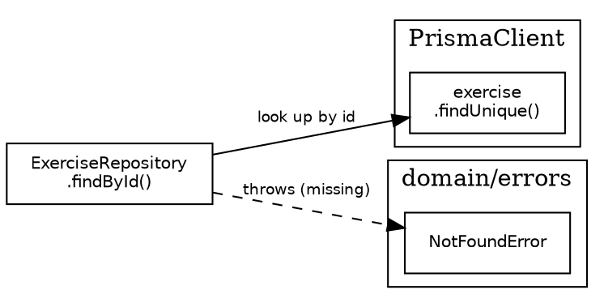

# Integration Testing Guide — Repository Layer

This document is the authoritative reference for writing integration tests and their
accompanying IT form descriptors for the repository layer of this project.
Follow every rule here precisely and in order.

---

## 1. What Integration Testing Means Here

An integration test (IT) answers one question:
**"Do these two components work together as intended?"**

It is not a unit test. It does not mock dependencies. It does not test a component in
isolation. It tests the *contract at the boundary* between two real components.

At the repository layer the boundary is always:
```
ExerciseRepository  ←→  PrismaClient  ←→  PostgreSQL
```

Every test must therefore:
- Run against a real PostgreSQL database (the test database, not production).
- Use the real `PrismaClient` — no mocking.
- Seed data directly via `prisma.*` calls, never via the repository under test.
- Assert both the **return value** of the repository method *and* the **resulting
  database state** by querying Prisma directly after the act.

The rule of thumb: if you could write the test without a database, it is not an
integration test.

---

## 2. Bottom-Up Integration Order

Integration tests are written and run **bottom-up**: start at the persistence layer and
work upward only after the layer below is fully verified.

```
Controller  (tested last — depends on Service being verified)
    ↑
Service     (tested after Repository is verified)
    ↑
Repository  ← start here
    ↑
Database
```

This means:
- When writing repository ITs, the service and controller layers do not exist in the
  test. The test drives the repository directly.
- Never reach upward into a higher layer to seed or verify data.
- Never use the repository under test to set up its own preconditions (always seed via
  raw Prisma).

---

## 3. Workflow — Descriptor Before Test

The mandatory workflow for every new method is:

```
1. Fill in the ItDescriptor in *-it-forms.ts
2. Run npm run generate-it-forms:... to produce the xlsx workbooks
3. Implement the Jest test cases in *.integration.test.ts
```

The descriptor is the specification. The Jest file is the implementation.
They must stay in sync — every `tcRow` in the descriptor maps 1-to-1 to one `it()`
block in the test file.

---

## 4. Filling in the ItDescriptor

### 4.1 Header fields

| Field | What to write |
|---|---|
| `reqId` | Unique identifier, e.g. `REPO-3`. Increment per method. |
| `statement` | One sentence: `ClassName.methodName(signature): ReturnType — what it does.` |
| `data` | The input parameters and their types, written as they appear in the signature. |
| `precondition` | The database state required before the method is called. |
| `results` | The return value type and a plain-English description of it. |
| `postcondition` | What the database state looks like after the method returns, including error paths. |
| `remarks` | Always include the two run/teardown commands. |
| `tcsFailed` | Start at `0`. Update after a test run if failures occur. |
| `bugsFound` | Start at `0`. |
| `bugsFixed` | Start at `'n/a'`. |
| `retested` | Start at `'not yet'`. |
| `retestRun` | Start at `0`. |
| `coveragePercent` | Set to `'100%'` once all decision points are covered. |

### 4.2 sourceCode

Provide the exact source lines of the method under test as a `string[]`.
Each element is one line. Preserve indentation. Omit the surrounding class body.
This is rendered as a monospace panel in the xlsx workbook.

```typescript
sourceCode: [
    'async findById(id: string): Promise<Exercise> {',
    '    const exercise = await this.database.exercise.findUnique({',
    '        where: { id },',
    '    });',
    '    if (!exercise) {',
    '        throw new NotFoundError(`Exercise not found: ${id}`);',
    '    }',
    '    return exercise;',
    '}',
],
```

### 4.3 moduleDot

Provide a Graphviz DOT string that shows which external modules the method actually
invokes. Rules:

- `rankdir=LR` — always left-to-right.
- The method node is the leftmost node. Its `label` is `"ClassName\\n.methodName()"`.
- Group external nodes into `subgraph cluster_*` blocks labelled by module path
  (e.g. `"PrismaClient"`, `"lib/utils"`, `"domain/errors"`).
- Each node label names the specific operation: `"exercise\\n.findUnique()"`,
  `"escapeLike()"`, `"ConflictError"`.
- Solid edges represent normal call flow. Use `style=dashed` for throw paths.
- No `fillcolor`, no `style=filled`, no `color=` on clusters, no `penwidth`. Plain
  default Graphviz styling only.
- Only include operations the method actually calls — do not include the full class.



### 4.4 tcRows — one row per test case

Each `ItTcRow` has five fields:

| Field | What to write |
|---|---|
| `noTc` | Sequential number as a string: `'1'`, `'2'`, etc. |
| `arrange` | The database state before the act. List what is seeded and what the input values are. Use newlines to separate database state from input. |
| `act` | The exact method call, written as code. Include argument values. |
| `expectedReturn` | What the method returns or throws. For throws, write `Throws NotFoundError` etc. |
| `expectedDbState` | The state of the relevant table(s) after the act. For read-only methods write `No change`. |
| `actualResult` | `'Passed'` or `'Failed — <short description>'`. |

---

## 5. Enumerating Test Cases — Decision-Point Coverage

Integration tests at the repository layer have no CFG to draw. Use this equivalent
framework instead: enumerate every **decision point** in the method — every place where
the outcome can differ based on input or database state — and ensure every branch has
at least one test case.

### 5.1 Decision-point checklist per method type

**Write/mutate methods** (`create`, `update`, `delete`, `setActive`):
- [ ] Happy path — operation succeeds, correct value returned, DB state verified
- [ ] Row not found — `NotFoundError` thrown, DB unchanged
- [ ] Constraint violation — `ConflictError` thrown, DB unchanged (original row preserved)
- [ ] Partial input — only specified fields change, unspecified fields are untouched
- [ ] Empty input `{}` — no fields mutated
- [ ] Self-reference — e.g. updating a name to the same value it already has

**Read methods** (`findById`, `findAll`):
- [ ] Happy path — correct rows returned with all fields matching DB
- [ ] Not found / empty result — `NotFoundError` or empty page returned
- [ ] Each filter option individually
- [ ] Combinations of two filters together (focus on combinations that share a code branch)
- [ ] Pagination: normal slice, last page (smaller than pageSize), pageSize > total
- [ ] Boundary inputs that test guards: `page=0`, special characters in search strings

**After-error stability** (applies to all mutating methods):
- [ ] After a method throws, a subsequent valid call on a *different* row succeeds —
  confirming the failed call left no implicit lock or corrupted state

### 5.2 RIGHT BICEP as a secondary check

After you have covered all decision points, run through RIGHT BICEP to catch anything
missed:

| Letter | Question | Example at repository layer |
|---|---|---|
| **R**ight | Are the results right? | Return value fields match exactly what was seeded / inserted |
| **B**oundary | What are the boundary conditions? | `page=0`, `pageSize=100` with 2 rows, search term `""`, search with `%` wildcard |
| **I**nverse | Can you check an inverse relationship? | After `setActive(false)`, `findAll()` (default) must exclude the row |
| **C**ross-check | Can you verify using another means? | Always assert DB state via raw Prisma after every mutating call |
| **E**rror | Can you force all error paths? | `NotFoundError`, `ConflictError` — every `throw` in the method body |
| **P**erformance | Any perf constraints? | Not tested at this layer — note and defer if relevant |

---

## 6. Test File Structure

### 6.1 File location and naming

```
lib/repository/__tests__/it/exercise-repository.integration.test.ts
```

Pattern: `<entity>-repository.integration.test.ts`

### 6.2 Top-of-file setup

```typescript
import {PrismaClient} from '@/prisma/generated/prisma/client';
import {PrismaPg} from '@prisma/adapter-pg';
// domain imports ...

const adapter = new PrismaPg({connectionString: process.env.DATABASE_URL!});
const prisma  = new PrismaClient({adapter});

// Reset singleton between tests so each test gets a fresh instance
beforeEach(() => {
    (ExerciseRepository as unknown as {instance: unknown}).instance = undefined;
});

// Wipe tables in dependency order before each test
beforeEach(async () => {
    await prisma.workoutSessionExercise.deleteMany();
    await prisma.user.deleteMany();
    await prisma.exercise.deleteMany();
});

afterAll(async () => {
    await prisma.$disconnect();
});
```

Rules:
- Two `beforeEach` hooks: one resets the singleton, one wipes the DB. Keep them
  separate — their concerns are different.
- The `afterAll` hook must always disconnect Prisma to avoid open handles.
- Wipe tables in reverse-dependency order (children before parents) to avoid FK
  constraint errors.

### 6.3 Seeder helpers

Seed all shared preconditions through dedicated `seed*` helper functions, not inline
`prisma.*` calls scattered across tests.

```typescript
const seedExercise = async (
    overrides: Partial<CreateExerciseInput & {isActive: boolean}> = {},
) => {
    return prisma.exercise.create({
        data: {
            name:            overrides.name            ?? 'Bench Press',
            description:     overrides.description     ?? 'Classic chest compound exercise',
            muscleGroup:     overrides.muscleGroup      ?? MuscleGroup.CHEST,
            equipmentNeeded: overrides.equipmentNeeded  ?? Equipment.BARBELL,
            isActive:        overrides.isActive         ?? true,
        },
    });
};
```

Rules:
- All fields must have defaults so callers only specify what matters for the test.
- Seeders must use raw Prisma — never call the repository under test to set up state.
- Name seeders after what they produce: `seedExercise`, `seedWorkoutSessionExercise`.
- When a seeder requires a chain of related rows (user → member → session → exercise),
  create the entire chain inside the seeder. Tests must not know about the chain.

### 6.4 describe / it structure

```typescript
describe('methodName', () => {

    it('methodName_scenario_expectedOutcome', async () => {
        // Arrange
        ...

        // Act
        ...

        // Assert
        ...
    });

});
```

One `describe` block per method, in the order they appear in the repository source.
All test cases for a method live inside its `describe` block.

---

## 7. AAA Pattern — Arrange / Act / Assert

Every `it` block must follow AAA strictly. Use blank lines to separate the three phases.
Do not add `// Arrange` comments — the blank-line separation is sufficient and less
noisy.

```typescript
it('create_newExercise_returnsPersistedRowWithAllFields', async () => {
    const repository = ExerciseRepository.getInstance(prisma);
    const input: CreateExerciseInput = {
        name:            'Deadlift',
        description:     'Posterior chain compound movement',
        muscleGroup:     MuscleGroup.BACK,
        equipmentNeeded: Equipment.BARBELL,
    };

    const result = await repository.create(input);

    expect(result.id).toBeDefined();
    expect(result.name).toBe('Deadlift');
    expect(result.isActive).toBe(true);
    const rowInDatabase = await prisma.exercise.findUnique({where: {id: result.id}});
    expect(rowInDatabase).not.toBeNull();
    expect(rowInDatabase!.name).toBe(input.name);
});
```

Rules:
- **Arrange**: Obtain the repository instance, seed required data, build the input.
  The repository instance is always obtained here, not at the top of the `describe`.
- **Act**: One statement. Assign the result to a named variable. For throws, wrap in
  `const action = () => repository.method(...)` and call `action()` in the assert.
- **Assert**: First assert the return value, then assert the database state directly
  using raw Prisma. Both are mandatory for every mutating method. For read-only
  methods, asserting the DB state is optional (write `No change` in the descriptor).

### 7.1 Asserting throws

```typescript
const action = () => repository.delete(nonExistentId);

await expect(action()).rejects.toThrow(NotFoundError);
const rowInDatabase = await prisma.exercise.findUnique({where: {id: seededExercise.id}});
expect(rowInDatabase).not.toBeNull(); // row must still be present
```

Always verify the DB state after an expected throw — the point is to confirm the
failed operation left the database unchanged.

---

## 8. Test Naming Convention

Pattern: `methodName_scenario_expectedOutcome`

All three segments are camelCase. The name must be readable as a sentence when the
underscores are read as "when" and "then":

> `findAll_searchTermContainsLikeWildcard_treatedAsLiteralAndMatchesNoRows`
> → "findAll, when the search term contains a LIKE wildcard, then it is treated as a literal and matches no rows"

Rules:
- **methodName**: exact method name as it appears in the repository.
- **scenario**: the database precondition and/or the input condition that makes this
  test distinct. Be specific — `duplicateName` not `badInput`,
  `includeInactiveWithMuscleGroupFilter` not `twoFilters`.
- **expectedOutcome**: what the system does in response. Prefer verb phrases:
  `returnsPersistedRowWithAllFields`, `throwsConflictErrorAndLeavesOnlyOneRowInDatabase`,
  `treatedAsLiteralAndMatchesNoRows`.
- The name must make the failure self-diagnosing — a developer reading a failing test
  name in CI should understand what broke without opening the file.
- Never use vague words: `works`, `correct`, `valid`, `invalid`, `test1`.

---

## 9. Cross-Cutting Rules

### 9.1 Always assert both return value and DB state for mutations

This is the defining characteristic of integration tests at this layer. A method could
return a stale in-memory object while the DB write failed. Asserting only the return
value does not catch that. Query Prisma directly for every mutating test.

```typescript
// After an update, always do both:
expect(result.name).toBe('Barbell Back Squat');           // return value
const row = await prisma.exercise.findUnique({...});
expect(row!.name).toBe('Barbell Back Squat');             // database state
```

### 9.2 Never use the repository under test to seed or verify

Seeding via `repository.create()` would make a failing `create` break every test in
the suite. Seeding via `prisma.exercise.create()` isolates the failure to the test that
owns it.

Similarly, never call `repository.findById()` inside another test's assert phase —
use raw Prisma.

### 9.3 Isolation between tests

Each test must be fully independent. The `beforeEach` wipe guarantees a clean slate.
Do not rely on execution order. Do not share mutable variables across `it` blocks
(the repository instance obtained inside each `it` is fine since the singleton is reset).

### 9.4 Filter combination coverage

For `findAll`-style methods with multiple orthogonal filter options, treat each option
as a boolean dimension. The minimum required combinations are:

- All options off (defaults)
- Each option on individually
- Two options on together — prioritise combinations that share a code branch
  (e.g. `includeInactive + muscleGroup` because both affect the same `where` clause)

Do not try to test every permutation of N options — focus on combinations where the
options interact in the implementation.

### 9.5 Escape and boundary inputs

Any input that passes through a transformation before reaching the database must be
tested with a value that would produce wrong results if the transformation were missing:

- `escapeLike` → test with a search string containing `%` or `_`
- `Math.max(1, page)` guard → test with `page=0`
- `pageSize` → test with a value larger than the total row count

The test must confirm that the guard/transform produces the correct DB result, not just
that it doesn't throw.

---

## 10. Descriptor ↔ Test File Correspondence

Every `tcRow` in the descriptor must have a corresponding `it()` block. The mapping
is by `noTc` order within the `describe` block. When you add a test case:

1. Add the `tcRow` to the descriptor first.
2. Regenerate the xlsx workbook.
3. Implement the `it()` block.

When a test is added after the initial pass (e.g. a gap is identified), insert the
`tcRow` at the end of the existing list and append the `it()` block at the end of the
`describe` block. Add a `// --- new case ---` comment before it to make the addition
visible in review.

---

## 11. Complete Example — Reference Implementation

The canonical implementation this guide was derived from:

- **Repository**: `lib/repository/exercise-repository.ts`
- **Test file**: `lib/repository/__tests__/it/exercise-repository.integration.test.ts`
- **Descriptors**: `lib/repository/__tests__/it/exercise-repository-it-forms.ts`
- **Renderer**: `scripts/generate-it-forms.ts`

The methods covered and their final TC counts:

| Method | TCs | Key coverage added beyond happy/error path |
|---|---|---|
| `create` | 3 | duplicate name, two independent rows |
| `findById` | 2 | existing row, missing id |
| `findAll` | 11 | each filter alone, two-filter combos, page=0 clamp, pageSize>total, LIKE wildcard escape |
| `update` | 6 | partial input, same name as self, empty input `{}` |
| `setActive` | 3 | true→false, false→true, missing id |
| `delete` | 5 | unreferenced, one-of-many, missing id, referenced, post-conflict stability |

Use this implementation as the reference when in doubt about any rule in this document.

---

## 12. Checklist Before Submitting

- [ ] Every decision point in the method has at least one test case.
- [ ] RIGHT BICEP has been applied as a secondary check.
- [ ] Every mutating test asserts both return value and DB state.
- [ ] No test seeds data using the repository under test.
- [ ] All test names follow `methodName_scenario_expectedOutcome`.
- [ ] All `it()` blocks follow AAA with blank-line separation.
- [ ] Every `tcRow` in the descriptor has a corresponding `it()` block.
- [ ] The descriptor was filled in and the xlsx regenerated before the tests were written.
- [ ] After-error stability is tested for every method that can throw.
- [ ] Filter combination coverage follows the dimension rule in §9.4.
- [ ] Boundary and escape inputs are covered per §9.5.